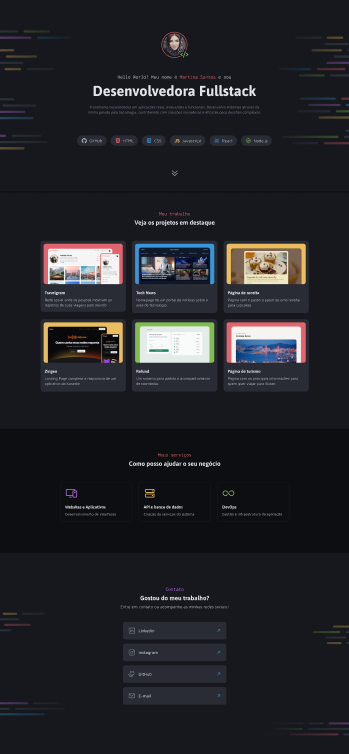

<h1 align="center"> Portifolio Dev </h1>

<a href="https://debstd22.github.io/Portifolio-dev/">Acesse o projeto finalizado clicando aqui</a>

   <a href="#objetivo-do-projeto">Objetivo do Projeto</a>&nbsp;&nbsp;&nbsp;|&nbsp;&nbsp;&nbsp;
   <a href="#tecnologias-utilizadas">Tecnologias Utilizadas</a>&nbsp;&nbsp;&nbsp;|&nbsp;&nbsp;&nbsp;
   <a href="#funcionalidades">Funcionalidades</a>&nbsp;&nbsp;&nbsp;|&nbsp;&nbsp;&nbsp;
   <a href="#layout">Layout</a>&nbsp;&nbsp;&nbsp;

&nbsp;

&nbsp;

## Objetivo do Projeto

Este projeto foi desenvolvido com o objetivo de apresentar minhas habilidades como desenvolvedora front-end, reunindo meus principais projetos, serviços e formas de contato em uma interface moderna e organizada.

A proposta foi aplicar na prática conceitos de HTML e CSS aprendidos durante meus estudos, com foco em estruturação semântica, responsividade e uma boa experiência do usuário.

## Tecnologias Utilizadas

- HTML5  
- CSS3 
- JavaScript 
- Git e GitHub

## Funcionalidades

- Seção de apresentação pessoal (hero)
- Botão de scroll
- Área de projetos em destaque
- Cards interativos com efeito hover
- Seção de serviços oferecidos
- Lista de links de contato (LinkedIn, GitHub, etc.)
- Uso de SVG para ícones customizáveis via CSS
- Layout organizado com Flexbox e CSS Grid
- Estilização moderna com foco em usabilidade e hierarquia visual

## Layout

Você pode visualizar o layout do projeto <a href="https://www.figma.com/design/1wyE4DKUMda9KQXiRpAdIs/Portfolio-Dev--Community---Copy-?node-id=0-1&p=f&t=ZTUcCC3AdUZrlucn-0">CLICANDO AQUI</a>. É necessário ter conta do <a href="https://www.figma.com/login?is_not_gen_0=true">FIGMA</a> para acessá-lo.